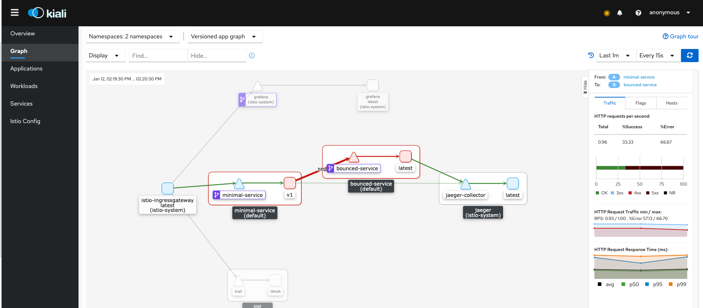
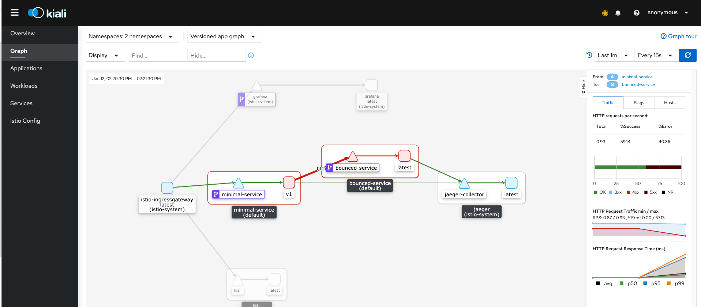
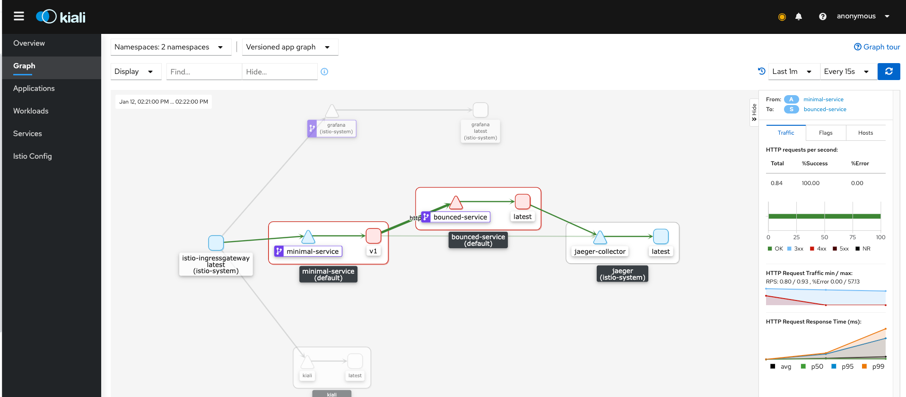
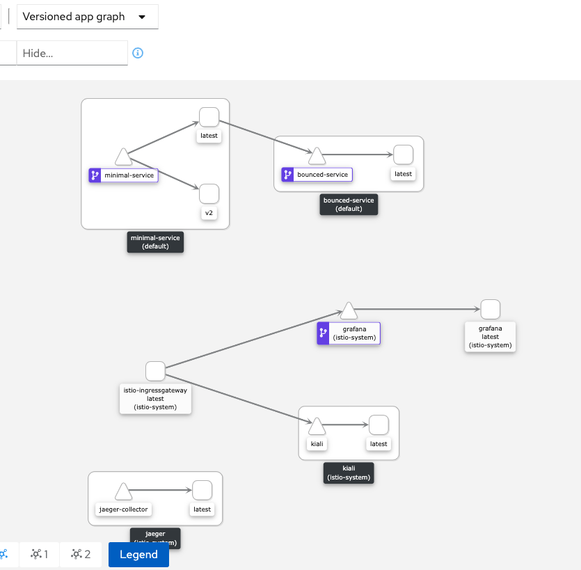

KUBE MESHY - Istio version
=========

## What for

This project wants to show some basic functionalities of service mesh in Kubernetes.
In this case we will use **Istio**.

## Components

1. _Kubernetes deployed locally with KinD_ ([https://kind.sigs.k8s.io/](https://kind.sigs.k8s.io/))
 
   I used KinD just for simplicity, but can use Minikube, or every other kind of Kubernetes implementation.

   > Kubernetes Version 1.19.1.

2. _Private Docker Registry_

   Not mandatory.

3. _Nginx ingress controller_

   Installed through simple yaml file, avoided Helm for the moment, 
   so you can use Nginx or Istio to handle outbound-inbound traffic.

4. _Simple minimal-service deployment_

   Just a microservice example for the sake of the test. Here you can find the code [https://github.com/efbar/minimal-service](https://github.com/efbar/minimal-service)

5. Istio service mesh_

   Installation taken from docs, nothing more.

   | Components injected | Notes |
   | ------------------- |:-----:|
   | minimal-service | [Dockerfile](https://github.com/efbar/minimal-service/blob/main/Dockerfile) |
   | bounced-service | [Dockerfile](https://github.com/efbar/minimal-service/blob/main/Dockerfile) |

## Installation

Let `kube-meshy-deploy.sh` be executable:

```bash
$ chmod +x kube-meshy-deploy.sh
```

then run it:

```bash
$ ./kube-meshy-deploy.sh
```

and wait.

Once done you can deploy everything you want.
Before that, use that private registry:

```bash
$ docker tag [YOUR-IMAGE]:[TAG] localhost:${REGISTRY_EXT_PORT}/[YOUR-IMAGE]:[TAG]
```

```bash
$ docker push localhost:5000/[YOUR-IMAGE]:[TAG]
```


### Play with mesh

#### Setup the mesh

Download Istio binaries:
```bash
$ curl -L https://istio.io/downloadIstio | sh -
```

then inside Istio folder, install it in "default" profile mode:

```bash
$ cd istio-1.8.1
$ istioctl install --set profile=default -y
```

After the installation is finished you'll see a new kubernetes namespace, `istio-system`, has been created.
Inside this namespace there are two pods of two deployment:

```bash
$ kubectl get deploy -n istio-system
NAME                   READY   UP-TO-DATE   AVAILABLE   AGE
istio-ingressgateway   1/1     1            1           10m
istiod                 1/1     1            1           10m
```

The gateway handles all the communications from outside to inside the cluster.
`istiod` is the control plane of the mesh.

We can now deploy some useful monitoring and tracing tools and integrate them with `Kiali`, that is a nice dashboard that can help you to manage the mesh:

```bash
$ kubectl apply -f istio/addons
```

The first time that you run the past command you will face some errors like:

`unable to recognize "istio/addons/kiali.yaml": no matches for kind "MonitoringDashboard" in version "monitoring.kiali.io/v1alpha1"`

re-run the command once again since at the moment of the Kiali deploy, Kiali CRDs weren't still available.

Now we have deployed:

```bash
$ kubectl get deploy -n istio-system
NAME                   READY   UP-TO-DATE   AVAILABLE   AGE
grafana                1/1     1            1           12m
istio-ingressgateway   1/1     1            1           12m
istiod                 1/1     1            1           12m
jaeger                 1/1     1            1           12m
kiali                  1/1     1            1           12m
prometheus             1/1     1            1           12m
```

To reach Kiali we can expose their services as NodePort, or pass through the gateway. Just for learning, we are going to do both:

```bash
$ kubectl patch svc kiali -n istio-system -p '[{"op":"replace","path":"/spec/type","value":"NodePort"},{"op":"add","path":"/spec/ports/0/nodePort","value":30200}]' --type "json"
$ kubectl patch svc grafana -n istio-system -p '[{"op":"replace","path":"/spec/type","value":"NodePort"},{"op":"add","path":"/spec/ports/0/nodePort","value":30300}]' --type "json"
```

with these command we are patching Kiali and Grafana kubernetes services and now you can explore Kiali and Grafana respectively at localhost:8081 and localhost:3000.

To pass through Istio's gateway: 

```bash
$ kubectl apply -f istio/services-gateway-istio.yaml
```

with this we deploy a gateway for the `istio-system` namespace, and it will handle all the requests with Host header `*.istio.kind.org`.

```bash
$ kubectl apply -f istio/kiali-virtualservice.yaml
```

Next, we deploy an Istio `VirtualService`, so you can then route requests to the final kubernetes service, in case of Kiali it is referred to requests with an Host header like `kiali.istio.kind.org`. We can test it with:

```bash
$ curl -s -H "Host: kiali.istio.kind.org" localhost:8080 -v
*   Trying ::1...
* TCP_NODELAY set
* Connected to localhost (::1) port 8080 (#0)
> GET / HTTP/1.1
> Host: kiali.istio.kind.org
> User-Agent: curl/7.64.1
> Accept: */*
> 
< HTTP/1.1 302 Found
< content-type: text/html; charset=utf-8
< location: /kiali/
< vary: Accept-Encoding
< date: Mon, 11 Jan 2021 15:05:55 GMT
< content-length: 30
< x-envoy-upstream-service-time: 0
< server: istio-envoy
< 
<a href="/kiali/">Found</a>.

* Connection #0 to host localhost left intact
* Closing connection 0
```

And we reached Kiali's pod.

----

##### Meshing workload

The next step is deploying the worker plane of the mesh. That means sidecar containers along side the actual workload pods.
One way to do this is marking a namespace as injectable of Istio's envoys:

```bash
$ kubectl label namespace default istio-injection=enabled
```

> From now on, every pod created within this namespace will be injected by an Istio's sidecar.

In our case we can deploy two deployments that will talk to each other.
They are called `minimal-service` and `bounced-service`.
For deploying them we need `Kustomize`, not the version inside `kubectl` but the official one since the merged one is not updated.
Install it with:

```bash
$ curl -s "https://raw.githubusercontent.com/\
kubernetes-sigs/kustomize/master/hack/install_kustomize.sh"  | bash
```

or on MacOS:

```bash
$ brew install kustomize
```

You can inspect what we're going to deploy with:

```bash
$ kustomize build test-services/overlays/minimal-service/
```

The output is composed by one deployment, one service and one ingress.
For the sake of tests, push `minimal-service` image in local registry as showed before (the image Dockerfile is located in the table at the beginning of the docs), for example:

```bash
$ curl -s -o Dockerfile https://raw.githubusercontent.com/efbar/minimal-service/main/Dockerfile
$ docker build . -t minimal-service:v1.0.0
$ docker tag minimal-service:v1.0.0 localhost:5000/minimal-service:v1.0.0
$ docker push localhost:5000/minimal-service:v1.0.0
```

Then we can really deploying them *applying* the output of the last command:

```bash
$ kustomize build test-services/overlays/minimal-service/ | kubectl apply -f -
```

and for bounced microservice,

```bash
$ kustomize build test-services/overlays/bounced-service/ | kubectl apply -f -
```

```bash
$ kubectl get pod                   
NAME                                  READY   STATUS    RESTARTS   AGE
bounced-service-7fd6cd6797-ngdfv      2/2     Running   0          15m
minimal-service-6d69cfd898-c4qmn      2/2     Running   0          15m
```

#### Use mesh feature

##### Gateways and Virtual Services

First thing, to reach our services deployed in `default` namespace we need a `Gateway` for that namespace:

```bash
$ kubectl apply -f istio/services-gateway.yaml
```

the subdomain used is little different:

`*.svc.kind.org`, the `.svc.` is the important one, just to be certain of not routing traffic to `istio-system` namespace.

Finally we can deploy a `VirtualService` for routing traffic to `minimal-service`.

```bash
$ kubectl apply -f istio/minimal-virtualservice.yaml
```

----

##### Retries

Now that we have all set up we can proceed to execute some requests from outside the cluster. In particular, we are going to make `POST` requests to `minimal-service` to a fixed path, passing a specific body. In this body we ask `minimal-service` to perform a `GET` request to an endpoint, in this case is `bounced-service` endpoint.

We deployed `bounced-service` with a particular configuration. In facts, `bounced-service` will respond `500` to the 70% of received requests. 

If we now test this, we can do:

```bash
$ for i in {1..10000}; do curl -s -H "Host: minimal.svc.kind.org" localhost:8080/bounce -d '{"rebound":"true","endpoint":"http://bounced-service:9090"}' | jq '.body' && sleep 1s; done
"500 Internal Server Error"
"500 Internal Server Error"
"500 Internal Server Error"
"200 OK"
"500 Internal Server Error"
"500 Internal Server Error"
"500 Internal Server Error"
"500 Internal Server Error"
"500 Internal Server Error"
"200 OK"
"200 OK"
"200 OK"
"500 Internal Server Error"
"500 Internal Server Error"
"500 Internal Server Error"
"200 OK"
"200 OK"
```

We can see that `minimal-service` is receiving a lot of 500s and we expected this behavior.

The image below confirm this:



Once we configure a `VirtualService` introducing `retries` on eventual 5xx errors, like:

```yaml
apiVersion: networking.istio.io/v1alpha3
kind: VirtualService
metadata:
  name: bounced-virtualservice-retries
spec:
  hosts:
  - bounced-service
  http:
  - route:
    - destination:
        host: bounced-service
        port:
          number: 9090
    retries:
      attempts: 20
      perTryTimeout: 2s
      retryOn: "5xx"
```
and apply that:

```bash 
kubectl apply -f istio/bounced-virtualservice-retries.yaml
```

we will notice that now responses are always `200`. This happens thanks to Envoy sidecar next to `bounced-service` container that retries at every `500` error received until it have `200`.

Kiali confirm the increasing of `200` responses percentage and the number of requests per second too:



after some seconds...


and finally:



----

##### Traffic Shifting

In some use cases we would like to test new versions of the same service without impacting on end users. `Canary deployment` or `Blue/Green` testing can be achieved brilliantly with Istio's service mesh.

Let's deploy another `minimal-service` deployment but this time, from a Kubernetes resources point of view, we call it `minimal-service-v2`.

```bash
$ kustomize build test-services/overlays/minimal-service-v2 | kubectl apply -f -
```

then we have to change just one thing, we have to remove `version` label from `selector` of Kubernetes service of `minimal-service`.

```bash
$ kubectl patch svc minimal-service -p '[{"op":"remove","path":"/spec/selector/version"}]' --type "json"
```

With this we allow that `minimal-service` Kubernetes service can be used as network entrypoint from both `minimal-service` (`v1` version) and `minimal-service-v2` (`v2` version) since both deployments have the same `selector`, `app=minimal-service`:

```bash
$ kubectl get deploy -l app=minimal-service              
NAME                 READY   UP-TO-DATE   AVAILABLE   AGE
minimal-service      1/1     1            1           25m
minimal-service-v2   1/1     1            1           10m
$ kubectl get deploy -l version=v1         
NAME              READY   UP-TO-DATE   AVAILABLE   AGE
minimal-service   1/1     1            1           25m
$ kubectl get deploy -l version=v2
NAME                 READY   UP-TO-DATE   AVAILABLE   AGE
minimal-service-v2   1/1     1            1           10m
```

After this, we have to apply an Istio's `DestinationRule`.
This object acts after VirtualService evaluation of routing.
We are creating, for `minimal-service` host, subsets of routing based on particular labelling. `v1` destination rule is for services with `version: v1` label, while `v2` are for services with `version: v2` label:

```bash
$ kubectl apply -f istio/minimal-destinationrule.yaml
```

In the image below we can see a new version of `minimal-service` added to the Kiali's versioned graph:



Finally we have to modify `minimal-service`'s `VirtualService` as we have to add traffic shifting:

```yaml
...
  http:
  - route:
    - destination:
        port:
          number: 9090
        host: minimal-service
        subset: v1
      weight: 50
    - destination:
        port:
          number: 9090
        host: minimal-service
        subset: v2
      weight: 50
```

now we are telling Istio's sidecars to route equally distributed traffic on two subset for `minimal-service` hosts.

```bash
kubectl apply -f istio/minimal-virtualservice-split.yaml
```

For testing this configuration:

```bash
$ for i in {1..20}; do curl -s -H "Host: minimal.svc.kind.org" localhost:8080 | jq '.servedBy' && sleep 1s; done
"minimal-service-v2-6dcb6884db-gsq22"
"minimal-service-6d69cfd898-c4qmn"
"minimal-service-6d69cfd898-c4qmn"
"minimal-service-v2-6dcb6884db-gsq22"
"minimal-service-6d69cfd898-c4qmn"
"minimal-service-6d69cfd898-c4qmn"
"minimal-service-6d69cfd898-c4qmn"
"minimal-service-v2-6dcb6884db-gsq22"
"minimal-service-v2-6dcb6884db-gsq22"
"minimal-service-v2-6dcb6884db-gsq22"
"minimal-service-6d69cfd898-c4qmn"
"minimal-service-6d69cfd898-c4qmn"
"minimal-service-6d69cfd898-c4qmn"
"minimal-service-v2-6dcb6884db-gsq22"
"minimal-service-v2-6dcb6884db-gsq22"
"minimal-service-v2-6dcb6884db-gsq22"
"minimal-service-v2-6dcb6884db-gsq22"
"minimal-service-v2-6dcb6884db-gsq22"
"minimal-service-6d69cfd898-c4qmn"
"minimal-service-6d69cfd898-c4qmn"
```

this confirms equal traffic routing and looking at Kiali we have this scenario beautifully showed:


----

##### Service Discovery and Service Entries

One of the key feature of Istio is Service Discovery and it works out of the box.
In our scenario we are going to try to reach an external service, not in the Kind cluster, simulating a classical use case.

To do this, first we have to run the external service. Since we have already downloaded the `minimal-service` image, we can run this with Docker service:

```bash
$ docker run --rm -p9090:9090 --name minimal-service minimal-service:v1.0.0
```

Now we have a service that can be called from Kind cluster. But at the moment we can't do it because our pods don't know how to resolve the eventual DNS name since we didn't add any kubernetes Service nor Endpoint.

From an architectural point of view we need a place to pass through to reach the external service, we need an `egress-gateway`.

```bash
$ kubectl apply -f istio/egress-gateway.yaml 
```

In this file we create an egress for HTTP protocol.
Then we have to route the L7 traffic through this: 

```bash
$ kubectl apply -f istio/egress-virtualservice.yaml
```

we are now telling Istio that every request with Host header `minimal.external.kind.org` that comes from the mesh, to route it to the destination `minimal.external.kind.org` passing trough the egress-gateway.

But how do we know to resolve `minimal.external.kind.org`?
We need Istio's `ServiceEntry`.

```bash
$ kubectl apply -f istio/service-entry.yaml
```

```yaml
...
  hosts:
    - minimal.external.kind.org
    exportTo:
    - "."
    location: MESH_EXTERNAL
    ports:
    - number: 9090
      name: http
      protocol: HTTP
    resolution: DNS
```

The `resolution` key can be `STATIC` or `DNS`.

In case of `DNS`, we would leave to an external resolver do the job, in our case we have to add to `/etc/hosts` file the IP address of `minimal-service` docker container:

```bash
$ docker inspect -f '{{.NetworkSettings.IPAddress}}' <CONTAINER_ID>
```

and add this IP address to our `/etc/hosts/`:

```bash
$ echo "<CONTAINER_IP_ADDR> minimal.external.kind.org" | sudo tee -a /etc/hosts
```

We can also avoid this by adding a static IP address to the `ServiceEntry`:

```yaml
  hosts:
    - minimal.external.kind.org
    exportTo:
    - "."
    location: MESH_EXTERNAL
    ports:
    - number: 9090
      name: http
      protocol: HTTP
    resolution: STATIC
    endpoints:
    - address: <CONTAINER_IP_ADDR>
```

Now we can test this with:

```bash
$ kubectl exec -it minimal-service-6d69cfd898-c4qmn -c minimal-service -- curl minimal.external.kind.org:9090 -v
*   Trying 172.17.0.6:9090...
* Connected to minimal.external.kind.org (172.17.0.6) port 9090 (#0)
> GET / HTTP/1.1
> Host: minimal.external.kind.org:9090
> User-Agent: curl/7.69.1
> Accept: */*
> 
* Mark bundle as not supporting multiuse
< HTTP/1.1 200 OK
< content-type: application/json
< date: Wed, 13 Jan 2021 10:29:25 GMT
< content-length: 1561
< x-envoy-upstream-service-time: 0
< server: envoy
< 
...
```

and the external service logs out:

```bash
$ docker run --rm -p9090:9090 --name minimal-service minimal-service:v1.0.0
Logger: 2021/01/12 17:09:47  [INFO] [Starting server on port 9090]
Logger: 2021/01/13 10:29:25  [INFO] [GET / 172.17.0.3:50466]
```

with `172.17.0.3` GET request received, that is the IP address of one worker node of Kubernetes:

```bash
docker ps | grep worker
853f4fd6cef9   kindest/node:v1.19.1     "/usr/local/bin/entr…"   4 hours ago   Up 4 hours   kube-1.19.1-worker
11da9c53c43a   kindest/node:v1.19.1     "/usr/local/bin/entr…"   4 hours ago   Up 4 hours   kube-1.19.1-worker2
```

```bash
$ docker inspect -f '{{.NetworkSettings.IPAddress}}' 11da9c53c43a
172.17.0.3
```